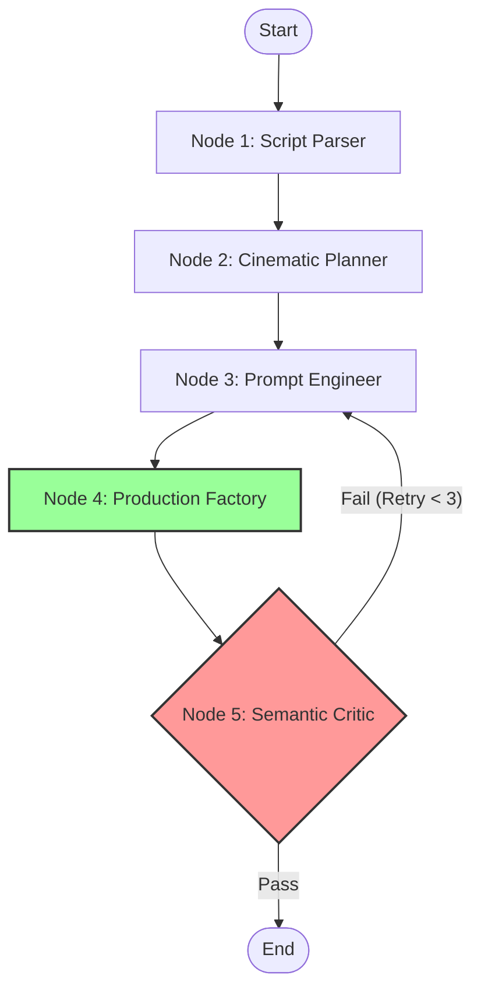

# 🎬 LFV-RE: Long-Form Video Reliability Engine

> **A deterministic, self-healing orchestration pipeline for long-form generative video.**

[](https://www.python.org/downloads/)
[](https://langchain-ai.github.io/langgraph/)
[](https://docs.pydantic.dev/)
[]()

## 🧠 The Problem

Current generative video models (Sora, Runway, Kling) are **stochastic engines**. They act like slot machines, producing high-quality but isolated clips. They suffer from **"Temporal Amnesia,"** unable to maintain narrative coherence, character identity, or visual style across a multi-minute timeline.

## 🛡️ The Solution

**LFV-RE** is not a video generator. It is a **Reliability Engine**.

It wraps stochastic models in a **deterministic control layer**, enforcing strict state management for character identity, narrative tension, and visual style. It transforms generative video from a "Creative Toy" into a "Production Operating System."

---

## 🏗️ Architecture

The system is built as a **Hierarchical Multi-Agent System (HMAS)** using **LangGraph**. It utilizes a cyclic graph for self-correction ("Self-Healing").



### Key Components

| Component | Responsibility | Tech Stack |
| --- | --- | --- |
| **Narrative State** | Tracks invisible variables (Tension, Time, Character Health). | Pydantic V2 |
| **Script Parser** | Deterministic Regex-based scene segmentation. | `re` (Python Core) |
| **Cinematic Engine** | Applies Film Grammar heuristics (e.g., "High Tension = 35mm Handheld"). | Heuristic Logic |
| **Prompt Generator** | Injects consistent style vectors and camera tokens. | String Templating |
| **Production Factory** | Modular adapter for Image (Flux) and Video (Runway/Kling). | Adapter Pattern |
| **Visual Critic** | **(New)** Uses a VLM (Mock/GPT-4o) to "watch" the generated video, caption it, and semantically compare that caption against the original script. Validates **Reality**, not just Intent. | `VisionService` |

## 🔬 "System 2" Engineering Features
...
### 4. Determinism Verification
Identical script inputs produce bit-exact `ShotPlan` objects. This property is verified via SHA-256 checksums of the state object at the "Planning" checkpoint.

---

## 📂 Project Structure

```text
lfv-re-engine/
├── output/
│   ├── assets/             # Generated Artifacts (PNG/MP4)
│   ├── checkpoints/        # State snapshots (JSON)
│   └── telemetry.csv       # Observability logs
├── src/
│   ├── core/
│   │   ├── config.py       # Environment & API Settings
│   │   ├── schemas.py      # Pydantic Data Models (State, ShotPlan)
│   │   ├── graph.py        # Main Workflow Definition
│   │   ├── parser.py       # Script -> NarrativeState
│   │   ├── cinematographer.py # State -> ShotList
│   │   ├── prompt_engineer.py # ShotList -> Text Prompts
│   │   └── telemetry.py    # Event Logging Service
│   └── services/
│       ├── generator.py    # Image Generation Adapter (Mock/Flux)
│       ├── video.py        # Video Generation Adapter (Mock/Runway)
│       └── critic.py       # Semantic Evaluation Service
├── main.py                 # Entry Point
├── .env.example            # Environment Template
├── .env                    # API Keys (GitIgnored)
└── requirements.txt        # Dependencies
```

---

## 🚀 Getting Started

### 1. Installation

```bash
# Clone repository
git clone https://github.com/your-username/lfv-re-engine.git
cd lfv-re-engine

# Create virtual environment
python3 -m venv venv
source venv/bin/activate

# Install dependencies
pip install -r requirements.txt
```

### 2. Configuration (`.env`)

By default, the system runs in **Mock Mode** (Free, Local, Fast). To enable real generation, copy `.env.example` to `.env`:

```bash
cp .env.example .env
```

Edit `.env`:

```ini
# Core Settings
USE_MOCK=true  # Set to 'false' to enable Real APIs
MAX_RETRIES=3
CRITIC_PASS_RATE=0.3  # Cosine similarity threshold

# API Keys (Required if USE_MOCK=false)
FLUX_API_KEY=your_key_here
RUNWAY_API_KEY=your_key_here
```

### 3. Run the Engine

```bash
python3 main.py
```

You will see the pipeline execute:

1. **Parse** the Sample Script.
2. **Generate** a Shot List based on Cinematic Rules.
3. **Generate** Debug Images (with text overlays) in `output/assets`.
4. **Render** Mock Video clips.
5. **Critique**: The Semantic Critic will measure the distance between the Script and the Prompt.
6. **Self-Heal**: If the score is too low, the system loops back to regenerate!

---

## 🔬 "System 2" Engineering Features

### 1. Deterministic Shot Planning

We do **not** ask the LLM "how to shoot this." We **tell** it.

* **Rule**: If `dialogue_density > 100`, Force Close-Up.
* **Rule**: If `tension > 0.8`, Force Handheld.
* **Result**: 100% reproducible camera decisions.

### 2. Semantic Consistency Checks

Instead of random QA, we use **BERT Embeddings** (`all-MiniLM-L6-v2`) to mathematically verify that the generated prompt aligns with the original script's semantic intent.

### 3. Observability & Telemetry

The engine writes a structured `telemetry.csv` log tracking the latency, status, and semantic scores of every generation event, enabling quantitative reliability analysis.

### 4. State Persistence

The system performs **Checkpointing** (JSON dumps) after every node execution, allowing for crash recovery and audit trails.

---

## 🔮 Future Roadmap

* [ ] **Vector Database Integration**: Store `EmotionalVector` in `pgvector`.
* [ ] **Real-Time VLM Critic**: Use GPT-4o-Vision to actually "look" at the generated images for QA.
* [ ] **Cost Optimization Agent**: Intelligently decide between "Generate New" vs "Interpolate Old" to save budget.
* [ ] **Human-in-the-Loop**: LangGraph breakpoint for manual Director approval before video rendering.

---

## 📊 Example Output

```json
{
  "scene_id": "SCENE-003",
  "header": "EXT. ALLEYWAY - NIGHT",
  "tension_level": 0.9,
  "shot_plans": [
    {
      "shot_id": "SCENE-003-SHOT-001",
      "shot_type": "Wide",
      "lens": "35mm",
      "camera_movement": "Tracking",
      "prompt": {
        "positive_prompt": "alleyway, John pulls a GUN...",
        "seed": 1120861071
      },
      "assets": {
        "image_url": "file:///path/to/SCENE-003-SHOT-001.png",
        "video_url": "file:///path/to/SCENE-003-SHOT-001.mp4"
      }
    }
  ]
}
```

---

## 🛠️ Tech Stack

* **Python 3.10+**
* **LangGraph** - Stateful workflow orchestration
* **Pydantic V2** - Data validation and schemas
* **Sentence-Transformers** - Semantic embedding evaluation
* **Pillow** - Debug image generation

---

## 👤 Author

**Abhimanyu Dhanwadia**

---

## 📄 License

MIT License - See LICENSE file for details